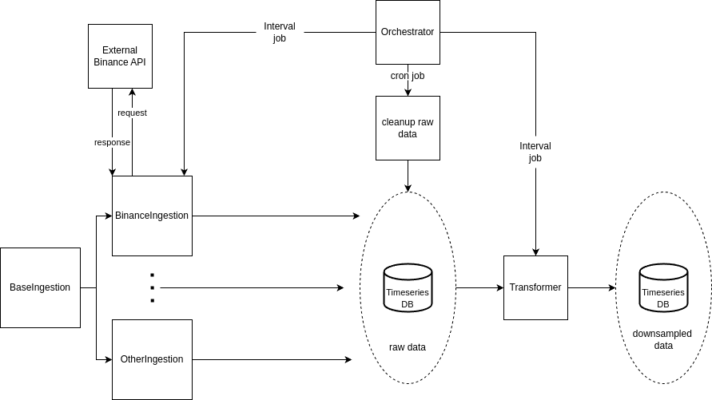

# Binance Data Ingestion and Processing Pipeline
# Submission by Michail Mpastakis

## Table of Contents

- [Binance Data Ingestion and Processing Pipeline](#binance-data-ingestion-and-processing-pipeline)
  - [Table of Contents](#table-of-contents)
  - [Overview](#overview)
  - [Features](#features)
  - [Architecture](#architecture)
  - [Prerequisites](#prerequisites)
    - [Using Docker Compose](#using-docker-compose)
    - [Development with Dev Containers](#development-with-dev-containers)
  - [Running the Application](#running-the-application)
    - [Auditing the Database](#auditing-the-database)
    - [Clearing the Database](#clearing-the-database)
  - [Configuration](#configuration)
    - [Key Configuration Options](#key-configuration-options)
  - [Extending the Application](#extending-the-application)

## Overview

This project is a data ingestion and processing pipeline designed to collect real-time cryptocurrency price data from Binance, store it in a TimescaleDB (PostgreSQL extension), and perform downsampling for efficient data analysis. The pipeline includes data ingestion, transformation, storage, and auditing tools, all orchestrated using Docker and managed within a development container for streamlined development and deployment.

## Features

- **Real-time Data Ingestion:** Collects live cryptocurrency price data from Binance using their API.
- **Storage with TimescaleDB:** Efficiently stores large volumes of time-series data since we are dealing with timestamped data.
- **Data Transformation:** Downsamples raw data for optimized storage and analysis. Downsampling using average and median.
- **Scheduled Tasks:** Automates data ingestion and transformation using APScheduler.
- **Dev Container Support:** Facilitates a consistent development environment with VS Code's Dev Containers.
- **Testing Suite:** Ensures code reliability with pytest.
- **Database Management Tools:** Provides utilities for auditing and clearing database tables.
- **Logging:** Implements robust logging for monitoring and debugging.

## Architecture



The architecture comprises the following components:

1. **Ingestion Client:** Connects to Binance API to fetch price data.
2. **Raw Data Repository:** Stores ingested data in the `raw_data` table.
3. **Data Transformer:** Processes raw data to compute average and median prices.
4. **Downsampled Data Repository:** Stores processed data in the `downsampled_data` table.
5. **Orchestrator:** Manages scheduled tasks for data ingestion and transformation.
6. **Database:** TimescaleDB for efficient time-series data storage.
7. **Dev Container:** Provides a consistent development environment.

## Prerequisites

- [Docker](https://www.docker.com/get-started) installed on your machine.
- [Docker Compose](https://docs.docker.com/compose/install/) installed.
- [Visual Studio Code](https://code.visualstudio.com/) with the [Remote - Containers](https://marketplace.visualstudio.com/items?itemName=ms-vscode-remote.remote-containers) extension (optional, for using Dev Containers).

### Using Docker Compose

Start the services using Docker Compose:

```
docker-compose -f docker-compose.yml up --build
```

This command will build and start both the application and the TimescaleDB services.

### Development with Dev Containers

If you prefer to work within a Dev Container for a consistent development environment:

1. **Open the Project in VS Code:**

   - Launch VS Code.
   - Open the project folder.

2. **Reopen in Container:**
   - Press `F1` and select `Remote-Containers: Reopen in Container`.
   - VS Code will build the Dev Container based on `.devcontainer/devcontainer.json` and attach to it.

## Running the Application

Once the Docker services are up, you can run the application:

```bash
python main.py
```

For easier execution of the application I would suggest to use the docker-compose

```bash
docker-compose -f docker-compose.yml up --build
```

This command executes all tests located in the `tests/` directory:

```bash
pytest
```

### Auditing the Database

To audit the current state of the database, use the `audit_db.py` script:

```bash
python tools/audit_db.py
```

This script provides details such as total records, counts per symbol, data samples, and time ranges for both raw and downsampled data.

### Clearing the Database

To clear data from the database tables, use the `clear_db.py` script with appropriate flags:

- **Clear Raw Data:**

  ```bash
  docker-compose -f docker-compose.yml -f docker-compose.dev.yml exec app python tools/clear_db.py --raw
  ```

- **Clear Downsampled Data:**

  ```bash
  docker-compose -f docker-compose.yml -f docker-compose.dev.yml exec app python tools/clear_db.py --downsampled
  ```

- **Clear Both Tables:**

  ```bash
  docker-compose -f docker-compose.yml -f docker-compose.dev.yml exec app python tools/clear_db.py --raw --downsampled
  ```

## Configuration

All configurable parameters are located in the `config.yml` file:

### Key Configuration Options

- **symbols:** List of cryptocurrency symbols to ingest data for.
- **sampling_frequency:** Interval in seconds between each data ingestion call.
- **downsampling_frequency:** Interval in minutes for data transformation tasks.
- **data_points:** Number of data points to collect before triggering a transformation.
- **api_rate_limit:** Maximum number of API calls allowed per second to Binance.
- **max_workers:** Maximum number of worker threads for concurrent tasks.

## Extending the Application

- To ingest data for additional symbols, simply add them to the `symbols` list in `config.yml`:
- Add apache airflow for easier workflow orchestration
- Add aggregation in symbol ingestion and insert them together in the DB using 1 db call
- Add second database for reliability (for production setup)
